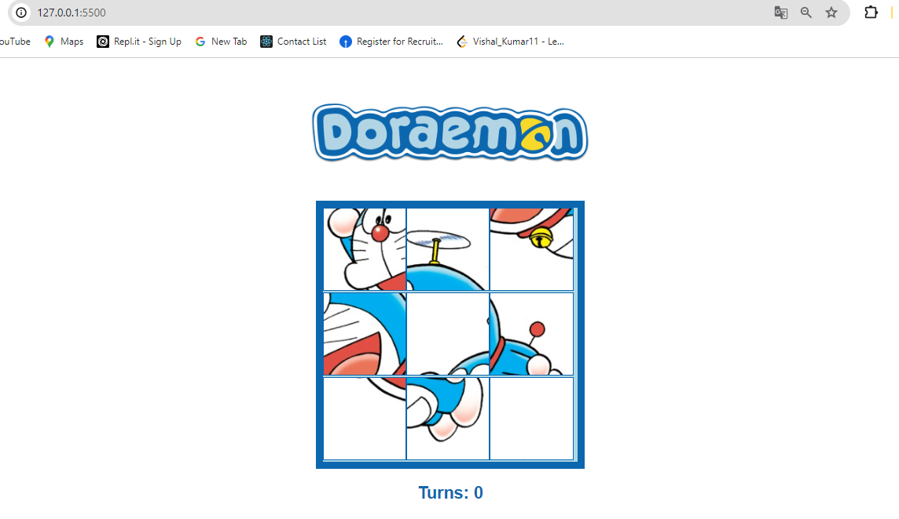

# Slide-Puzzle Game

This project is a simple slide-puzzle game built using HTML, CSS, and JavaScript. The game allows users to drag and drop pieces to solve the puzzle.

## File Structure

- `index.html`: The main HTML file that contains the structure of the web page.
- `style.css`: The CSS file that styles the web page.
- `script.js`: The JavaScript file that contains the logic for the puzzle game.

## Description of Files

### index.html

The HTML file defines the structure of the web page. It includes:
- The `<!DOCTYPE html>` declaration and the opening `<html>` tag with a language attribute set to "en".
- The `<head>` section which contains metadata, including the character set, viewport settings, the title of the page, and a link to the external CSS file.
- The `<body>` section which contains the main content of the page:
  - An image element for the logo.
  - A div element for the puzzle board.
  - A heading element to display the number of turns taken.
- A script tag that links to the external JavaScript file.

### style.css

The CSS file styles the web page:
- General styles for the body and elements to center content and set fonts and colors.
- Specific styles for the logo, board, and images within the board to ensure proper layout and responsiveness.
- Media queries for responsiveness on smaller screens.

### script.js

The JavaScript file contains the logic for the puzzle game:
- Variable declarations for DOM elements and game state.
- Event listeners for drag-and-drop functionality.
- Functions to handle the start, over, enter, leave, drop, and end of the drag events.
- Logic to swap images when a valid move is made and update the turn count.

## Usage

To use the application:
1. Open `index.html` in a web browser.
2. Drag and drop the puzzle pieces to solve the puzzle.
3. The number of turns taken is displayed below the puzzle board.

## Dependencies

No external dependencies are required for this project. It uses plain HTML, CSS, and JavaScript.

## Notes

- The puzzle pieces are represented by image files in the `./pictures` directory.
- The game allows dragging and dropping pieces to rearrange them.

## Contributing

Contributions are welcome! If you have suggestions or improvements, please fork the repository and submit a pull request.

1. Fork the Project
2. Create your Feature Branch (`git checkout -b feature/AmazingFeature`)
3. Commit your Changes (`git commit -m 'Add some AmazingFeature'`)
4. Push to the Branch (`git push origin feature/AmazingFeature`)
5. Open a Pull Request

## License

This project is open source and available under the [MIT License](LICENSE).

## Output Screen

   - #### before starting game
   

   - After Completing the game
   
